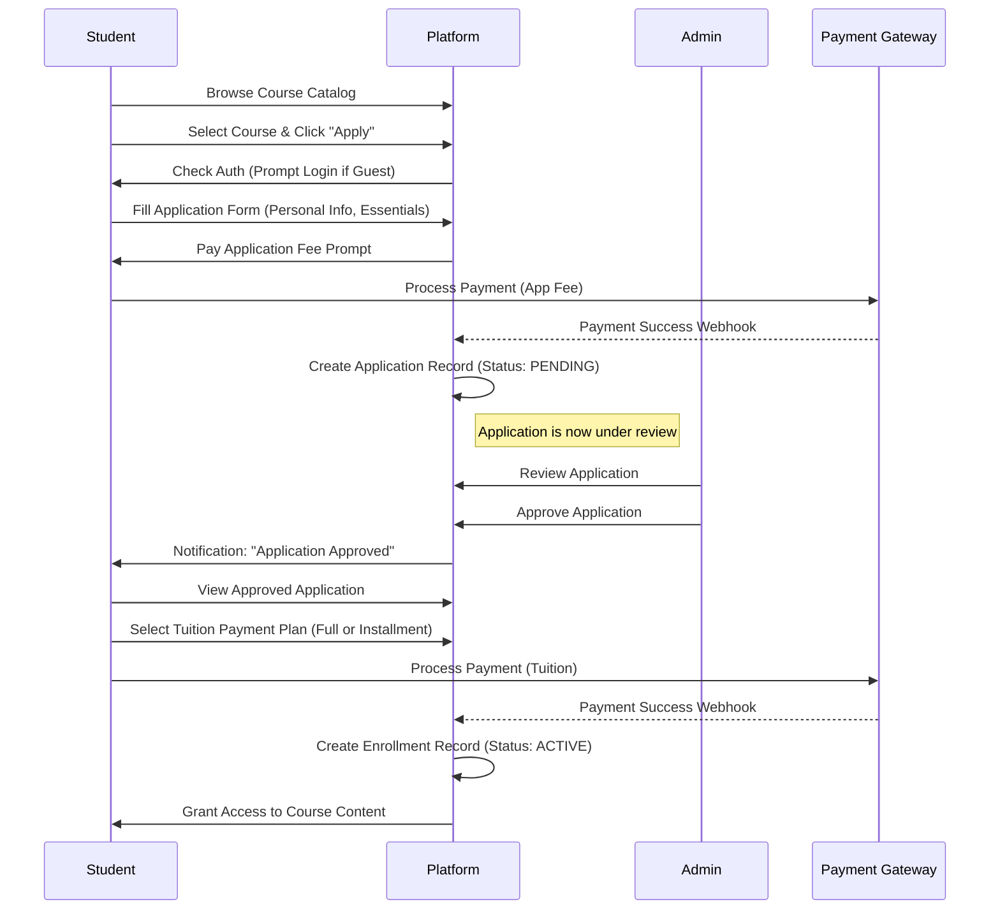
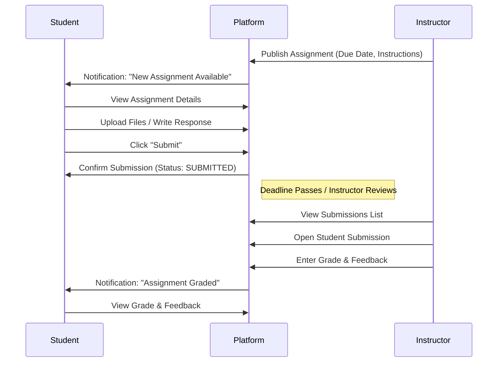

# KM Media Training Institute - Product Master Design Document (PMDD)

**Version:** 1.0
**Status:** Living Document
**Date:** 2025-12-26

---

## 1. Executive Summary
The **KM Media Training Institute Platform** is a comprehensive educational ecosystem designed to bridge the gap between media training and professional practice. It enables students to apply for courses, access high-quality video and text content, submit assignments for grading, and track their progress through gamified learning experiences. For instructors and administrators, it provides robust tools for course management, student assessment, and financial tracking.

## 2. User Personas & Roles

### 2.1 The Student ("The Learner")
*   **Goal**: Acquire new media skills, complete certifications, and build a professional portfolio.
*   **Key Activities**:
    *   Browsing and applying for courses.
    *   Paying application and tuition fees (including installments).
    *   Consuming video lessons and reading resources.
    *   Submitting assignments (files/text) and taking quizzes.
    *   Tracking progress via dashboards and gamification (streaks, badges).

### 2.2 The Instructor ("The Mentor")
*   **Goal**: Effectively teach courses and evaluate student performance.
*   **Key Activities**:
    *   Creating and structuring Course content (Lessons, Resources).
    *   Publishing Assignments and Quizzes.
    *   Grading submissions and providing feedback.
    *   Monitoring student attendance and engagement.
    *   Conducting Live Sessions.

### 2.3 The Administrator ("The Overseer")
*   **Goal**: Manage the operational and financial health of the institute.
*   **Key Activities**:
    *   Reviewing and approving Course Applications.
    *   Managing Users and Roles.
    *   Overseeing Financials (Payments, Installment Plans).
    *   System-wide configuration (Notifications, Global Settings).

---

## 3. Core Functional Functional Specifications

### 3.1 Authentication & Onboarding
*   **Methods**: Email/Password credentials and Social Login (GitHub/Google via NextAuth).
*   **Profile**: Rich profiles including Bio, Specializations, and Social Links.
*   **Security**: Role-Based Access Control (RBAC) ensuring Students cannot access Admin routes.

### 3.2 Learning Management System (LMS)
*   **Courses**: Can be Online, Offline, or Hybrid. Structure includes Modules and Lessons.
*   **Lessons**: Support for Video URLs (streaming), Rich Text Content, and Downloadable Resources (PDFs, Source Code).
*   **Progress Tracking**: Automatic tracking of lesson completion and time spent.
*   **Gamification**: "Learning Streaks" and "Achievements" (e.g., 'fast starter', 'quiz whiz') to boost engagement.

### 3.3 Assessment Engine
*   **Assignments**:
    *   Rich text instructions + Instructor attachments.
    *   Submission types: File Upload (Multi-file support) or Text.
    *   Deadlines with optional Late Penalties.
*   **Quizzes**:
    *   Multiple-choice questions.
    *   Auto-grading capability.
*   **Grading**: Instructor dashboard for reviewing submissions, providing feedback, and assigning grades.

### 3.4 Commerce & Payments
*   **Gateway**: Paystack integration.
*   **Application Fees**: Non-refundable fee required to submit a course application.
*   **Tuition**:
    *   Full Payment.
    *   Installment Plans (e.g., 40% upfront, 30% mid-course, 30% completion).
*   **Receipts**: Automated receipt generation for all transactions.

---

## 4. Critical User Flows

### 4.1 Course Application & Enrollment Flow
This flow describes how a visitor becomes an enrolled student.

### 4.2 Assignment Submission & Grading Loop
The core academic interaction loop.

---

## 5. Technical Architecture

### 5.1 Technology Stack
*   **Frontend**: Next.js 14+ (App Router)
    *   *Styling*: Tailwind CSS + Custom Design Tokens.
    *   *State*: React Query (@tanstack/react-query) for server state management.
    *   *Forms*: React Hook Form + Zod validation.
*   **Backend**: Next.js API Routes (Serverless Functions)
    *   *Runtime*: Node.js
*   **Database**: PostgreSQL
    *   *ORM*: Prisma (Type-safe database access).
*   **Storage**: Cloud Object Storage (for Assignment uploads, Profile images).
*   **Infrastructure**: Vercel (Deployment, Analytics).

### 5.2 Database Model Overview
*   **User Management**: `User` linked to `UserProfile` and role-specific auth data.
*   **Content**: `Course` 1:N `Lesson` 1:N `Resource`.
*   **Enrollment**: `User` M:N `Course` via `Enrollment` (tracks progress).
*   **assessments**: `Assignment` has many `AssignmentSubmission`.
*   **Financials**: `Payment` records linked to `Application` or `Enrollment`.

## 6. Future Roadmap
1.  **Mobile Application**: Native iOS/Android apps using Flutter (reusing API).
2.  **Offline Mode**: PWA capabilities for learning without internet.
3.  **Advanced Analytics**: AI-driven insights for student performance prediction.
4.  **Live Classrooms**: Integrated Zoom/WebRTC usage for `LiveSession`.

---
*Generated by Antigravity Agent - 2025*
